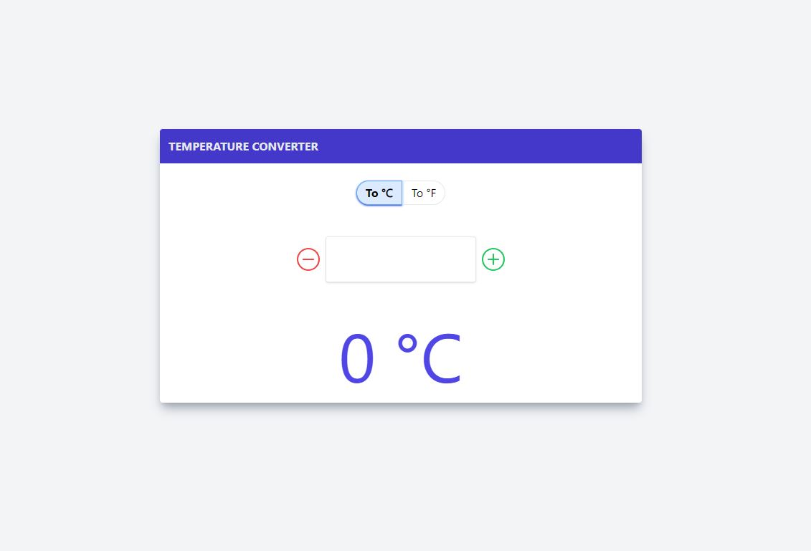

# Tailwind Temperature Converter

A super simple Temperature converter app designed using Tailwind CSS library.

[DEMO](https://github.com/shiburaj/temperature-converter)

### Libraries used
- Tailwind CSS
- Vanilla Javascript
- VueJS
- ReactJS

